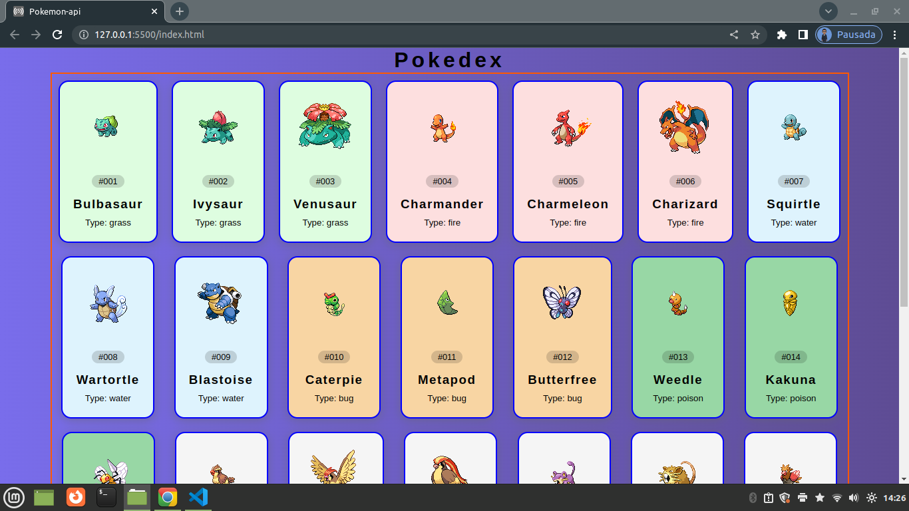

<h1 align="center">
1-Etapa - pokedex em JavaScript
</h1>

<h6 align="center">Bootcamp - Desafio - pokedex com JavaScript -HTML e CSS.</h6>
 

[

<h2 align="center">Potência Tech Angular Developer - Powered by iFood - Desafio - javascript</h2>

🔗 *** Objetivo é usar https://pokeapi.co/api/v2/pokemon/25.png como base para
obter os tipos e o nomes do pokemon

---

<h2 align="center"> Resultado</h2>

 
  # Procurando exibir 151 pokemons distribuidos uniformes 

 

---

<h2 align="center"> Conclusões finais</h2>

estaremos sempre em busca de melhorar <a href="edimirk9:edimirk9@gmail.com.br">edimirk9@gmail.com.br</a>

